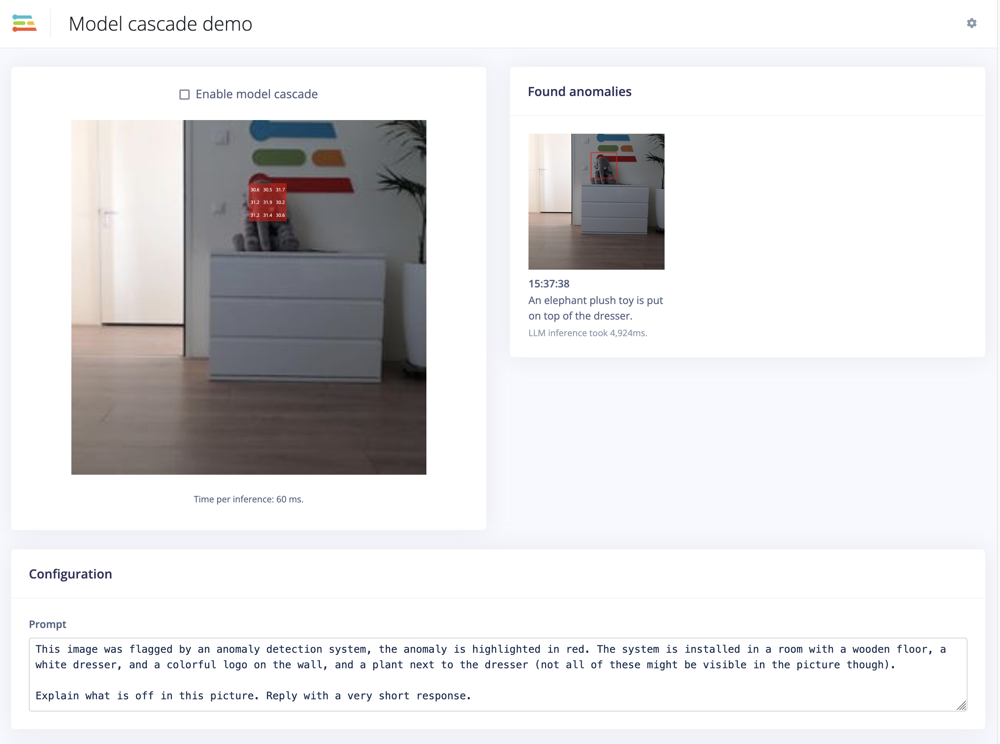

# Model cascade with Edge Impulse (FOMO-AD -> LLM)

This repository contains a demo using FOMO-AD (Edge Impulse's visual anomaly detection model) to find interesting parts of an image, then cascade to GPT-4o to do further analysis.



## Prerequisites

You'll need a trained visual anomaly detection model in Edge Impulse. [See the docs](https://docs.edgeimpulse.com/docs/edge-impulse-studio/learning-blocks/visual-anomaly-detection). Afterwards, download your model in .eim format, including hardware optimization via:

```
$ edge-impulse-linux-runner --clean --download path-to-your-model.eim
```

(Alternatively, go to **Deployment** in your Edge Impulse project, find the 'Linux' deployment for your architecture (e.g. 'Linux (AARCH64)'), and build from there).

## Setup

1. Install dependencies:

    ```
    npm install
    ```

2. Set your OpenAI API Key:

    ```
    export OPENAI_API_KEY=sk-MA...
    ```

3. Run the application:

    ```
    npm run build && node build/classify-camera-webserver.js ./path-to-your-model.eim
    ```

    If you have multiple cameras a message will be printed, and you should add the camera name as the last argument to the script above.

4. Go to http://localhost:4912/ and see the cascade working.
